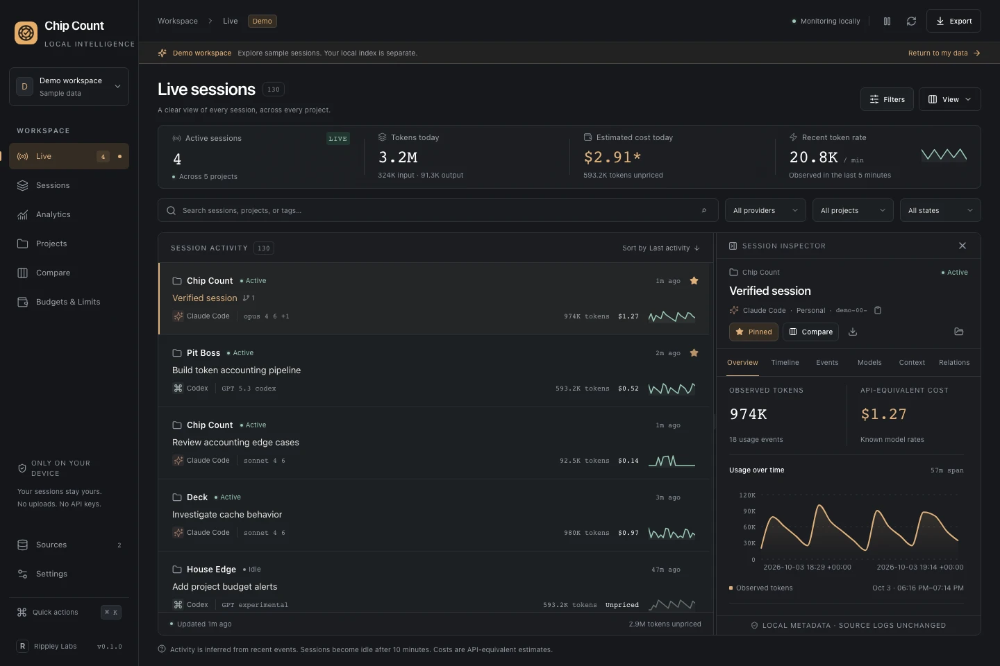
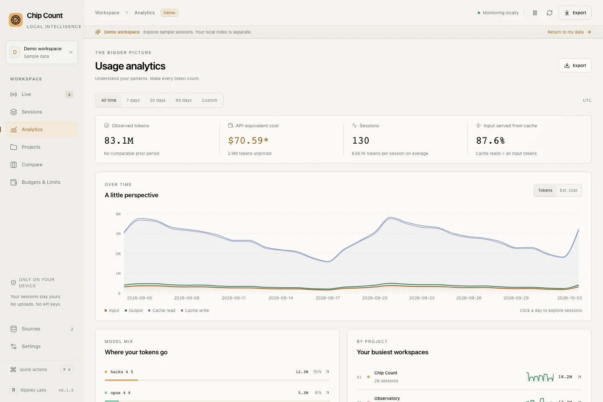

# 🎰 Chip Count

### Know what you're spending before the house does.

**Chip Count** is a local-first desktop dashboard for understanding your AI coding usage.

Sessions. Tokens. Models. Cache hits. Burn rate. API-equivalent cost.

No spreadsheets. No mystery math. No wondering where the hell 80 million tokens went.

**Count every chip.**

---

<p align="center">
  
</p>

<p align="center">
  <strong>Your sessions stay yours.</strong><br />
  Local monitoring. Local metadata. No uploads. No API keys required for local usage analysis.
</p>

---

## The house always keeps count.

Now you can too.

AI coding tools are spectacularly good at making token usage disappear into the background. You start a session, ask for a refactor, chase a bug for an hour, hand something off to another model...

...and suddenly you've burned millions of tokens across twelve sessions and have absolutely no idea where they went.

Chip Count turns that mess into something you can actually understand.

It watches your local session data and gives you a live view of:

- 🎯 active AI coding sessions
- 🪙 observed token usage
- 💸 API-equivalent cost
- ⚡ current token burn rate
- 🧠 model usage
- ♻️ cache effectiveness
- 📁 usage by project
- 📈 historical trends
- 🕒 session history
- 🎲 budgets and limits

Not because every token needs to be rationed.

Because **you should know where your chips are going.**

---

## Live table

<p align="center">
  
</p>

See what your coding agents are doing **right now**.

Chip Count surfaces active and recent sessions across your projects, including token totals, model information, estimated cost, recent activity, and usage velocity.

Open a session to inspect it without digging through log files.

### At a glance

- active sessions
- tokens used today
- estimated spend
- recent tokens/minute
- provider and model
- project association
- session activity
- usage timeline
- cache behavior
- priced vs. unpriced usage

Think `top`, but for the tiny artificial engineers eating your context window.

---

## Know where the chips went

<p align="center">
  
</p>

Totals are nice.

**Answers are better.**

Chip Count's analytics are built around a much simpler question:

> Where are my tokens actually going?

Break usage down across time, models, projects, sessions, and token types.

See whether your usage is climbing because of output generation, giant context windows, poor cache utilization, one particularly hungry project, or the 3 AM agent session you absolutely do not remember starting.

### Analytics include

- usage over time
- input vs. output tokens
- cache reads and writes
- estimated API-equivalent cost
- model mix
- busiest projects
- average usage per session
- historical periods
- session-level drilldown

---

## 🧮 API-equivalent cost

Chip Count can translate observed token usage into an estimated API-equivalent cost using model pricing metadata.

That number is intentionally described as an **estimate**.

Your actual subscription cost, provider billing, promotions, bundled usage, limits, and caching rules may differ.

Chip Count isn't pretending your subscription is secretly an API bill.

It's answering a more useful question:

> **"Roughly how much compute did I just throw at this problem?"**

And sometimes the answer is hilarious.

---

## ⚡ Watch the burn

A token count tells you what already happened.

A **burn rate** tells you what's happening now.

Chip Count tracks recent usage velocity so you can spot unusually aggressive sessions before they quietly consume half the county's electricity trying to rename a button.

Use pacing indicators to understand:

- tokens per minute
- unusually heavy sessions
- usage spikes
- projected consumption
- changes in behavior between models and projects

Your AI can move fast.

Chip Count makes sure you can see **how fast**.

---

## 🧠 Model intelligence

Not every model burns tokens the same way.

Chip Count keeps model usage visible so you can compare how different models behave across your actual work.

See:

- token consumption
- session counts
- estimated cost
- cache usage
- project distribution
- share of overall usage

If one model is responsible for half your token pile, you'll know.

---

## 📁 Project-aware

Tokens without context aren't very interesting.

Chip Count associates sessions with the projects you're actually working on so you can answer questions like:

> Why did **Pit Boss** consume twice as much as **Deck** this week?

> Which project is generating the longest sessions?

> Where am I spending most of my AI-assisted development time?

> Which repo is apparently attempting to bankrupt me?

Your projects become first-class usage dimensions instead of anonymous log entries.

---

## 🛡️ Local intelligence

Chip Count is designed around a simple rule:

> **Your development activity does not need to become somebody else's telemetry.**

Where possible, Chip Count works from data already present on your machine.

No analytics account should be required just to understand your own analytics.

No cloud database should be required just to inspect your own sessions.

No unnecessary copy of your prompts, code, or project history needs to exist somewhere else.

Your machine.

Your sessions.

Your chips.

---

## 🎰 Budgets & limits

Not every limit has to be a panic button.

Set boundaries around the things you actually care about:

- token usage
- estimated cost
- projects
- models
- time periods

Then use Chip Count as an instrument panel instead of discovering your usage after the fact.

---

## 🔍 Session history

Every session tells a story.

Usually one involving:

1. a perfectly reasonable request,
2. an unexpected architecture discussion,
3. fourteen files changing,
4. three increasingly desperate follow-up prompts,
5. and 900,000 tokens.

Chip Count keeps your session history searchable and inspectable so you can understand how your usage evolved instead of staring at one giant monthly total.

---

## 🆚 Compare

Compare sessions, models, projects, or time periods to see how your workflow changes.

Because:

> "This feels more expensive."

is considerably less useful than:

> "This model used 34% more tokens per comparable session."

Vibes are great.

Data is better.

---

## 📤 Your data isn't trapped

Chip Count is an analytics tool, not a data hostage situation.

Export your usage data when you need it for:

- spreadsheets
- deeper analysis
- personal dashboards
- accounting
- experiments
- backups
- questionable late-night Python scripts

CSV and JSON export make your data yours outside Chip Count too.

### Calendar reporting

A fresh workspace detects the operating system's IANA timezone. Change **Settings → Reporting timezone** to override it; existing workspaces keep their saved zone. Today, This Week, and This Month resolve in Rust in that zone, from local midnight at the calendar start to the current instant. **Weeks start Monday.** The reporting timezone and actual range appear above the workspace pages. Date-only custom end dates include the whole local day; timestamp ends are exclusive, and a custom start without an end runs through now. Cards, charts, sessions, rankings, and exports use the same event filter: a session crossing midnight contributes only events inside the range.

Calendar percentage comparisons use the previous calendar period at matching civil progress to date, capped at that period's end (for example, March 31 compared with complete February). The complete prior period is shown separately and is not the percentage baseline. The 7/30/90-day presets and custom ranges compare equal elapsed durations; all-time history has no preceding comparison. JSON and CSV exports include the resolved UTC boundaries, timezone, week start, and comparison boundaries.

Daily charts include zero-use days with uniform civil-day spacing. Minute charts use actual elapsed instants, distinguish repeated DST minutes, and place zero-use minutes around sparse gaps. Token stacks include uncached input, output (including reasoning), cache reads, and cache writes; reasoning is a subset of output. Cost charts disclose partial coverage and inferred prices. Highest-usage sessions are ranked from the full filtered backend view before pagination.


---

## 🌗 Looks good after midnight

Chip Count supports both light and dark appearances.

Because some of us write software during normal business hours.

And some of us look up and realize it's **2:13 AM**.

No judgment.

<p align="center">
  <em>Dark mode doesn't reduce token usage, but emotionally it helps.</em>
</p>

---

# Under the hood

Chip Count is a native desktop application built with **Rust + Tauri**.

The architecture is intentionally local-first:

```text
┌─────────────────────┐
│ Local AI tooling    │
│ session / usage logs│
└──────────┬──────────┘
           │
           ▼
┌─────────────────────┐
│     Chip Count      │
│                     │
│  Parse              │
│  Normalize          │
│  Price              │
│  Aggregate          │
│  Analyze            │
└──────────┬──────────┘
           │
           ▼
┌─────────────────────┐
│ Local persistence   │
└──────────┬──────────┘
           │
           ▼
┌─────────────────────┐
│ Live + historical   │
│ analytics           │
└─────────────────────┘
```

The goal is simple:

**observe locally, normalize cleanly, explain beautifully.**

---

## Supported sources

Chip Count is being built to understand usage from modern AI development tooling, including local session information produced by tools such as:

- Claude Code
- Codex
- additional providers as their local data formats are supported

Provider integrations are intentionally normalized into a common internal model so the analytics layer doesn't need to care which agent produced the session.

---

## Pricing metadata

Model pricing changes.

Frequently.

Because apparently stability would be boring.

Chip Count keeps model and pricing metadata separate from the core analytics logic so new models and pricing changes can be incorporated without rewriting the application.

Unknown usage is also shown as **unpriced** rather than silently inventing a number.

Because fake precision is worse than no precision.

---

# Philosophy

Chip Count is not trying to tell you that using AI is bad.

Quite the opposite.

Use the expensive model.

Run six agents.

Give one of them a 200,000-token context window because you don't feel like explaining the architecture again.

Go nuts.

But if we're going to drive these things like race cars, it'd be nice if somebody installed a **fuel gauge**.

That's Chip Count.

---

## Status

> 🚧 **Early development / pre-1.0**

Chip Count is currently being polished toward its first public release.

The goal for 1.0 is deliberately boring:

**Make the core experience excellent.**

Not accounts.

Not teams.

Not a cloud platform.

Not seventeen integrations nobody asked for.

A fast, beautiful, reliable desktop application that answers:

> **What are my AI coding tools doing, and where are my tokens going?**

---

## Road to 1.0

Core launch priorities:

- [ ] rock-solid session ingestion
- [ ] live session monitoring
- [ ] daily / weekly / monthly analytics
- [ ] token and cost breakdowns
- [ ] model analytics
- [ ] session history
- [ ] burn-rate and pacing indicators
- [ ] useful charts
- [ ] centralized model/pricing metadata
- [ ] local-first persistence
- [ ] polished empty/loading/error states
- [ ] excellent keyboard navigation
- [ ] native macOS menus
- [ ] light + dark themes
- [ ] CSV / JSON export
- [ ] production iconography
- [ ] App Store screenshots
- [ ] signed production build
- [ ] Mac App Store submission

**Scope creep goes to 1.1.**

The casino closes when 1.0 ships.

---

## Built by Rippley Labs

Chip Count is a **Rippley Labs** project.

Small software for people who like knowing what their computers are actually doing.

---

<p align="center">
  <strong>🎰 CHIP COUNT</strong><br />
  <sub>Count your chips. Know your burn.</sub>
</p>
